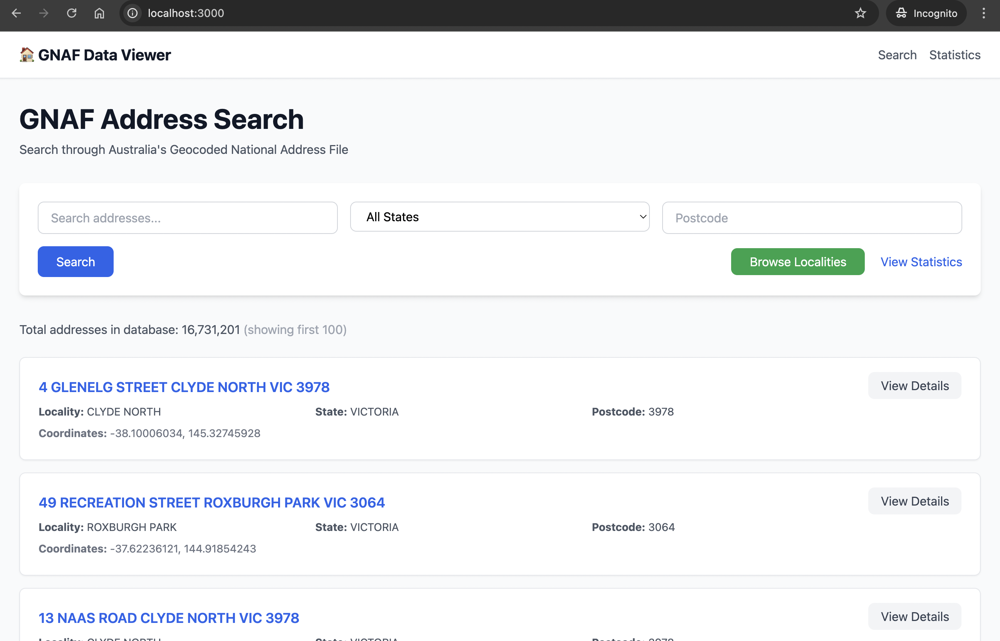
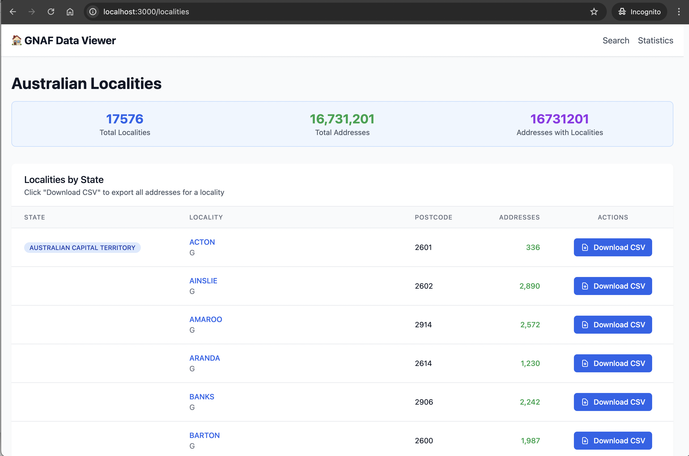
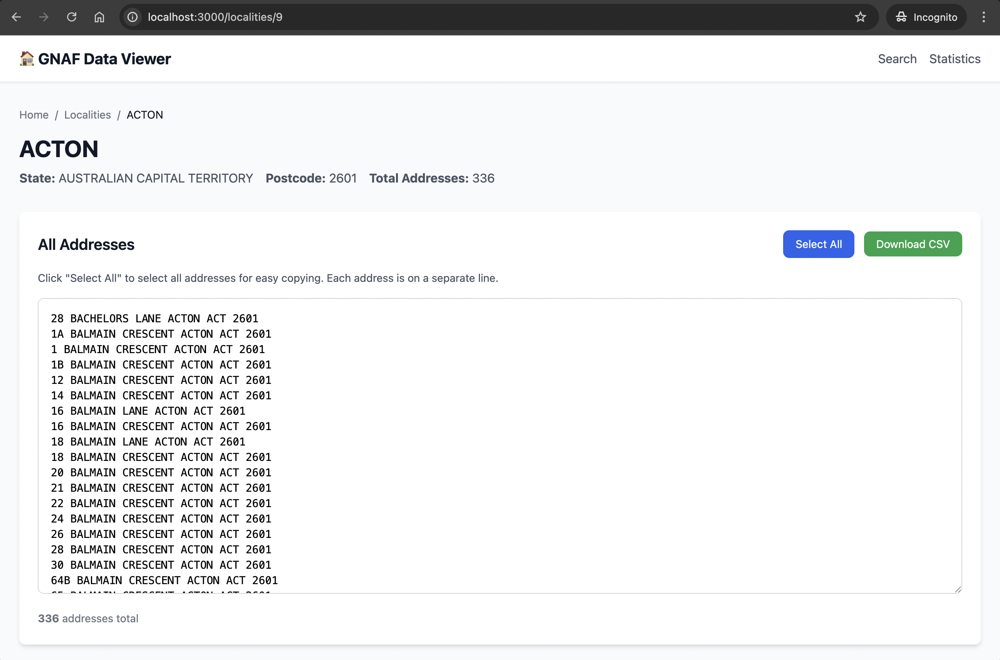
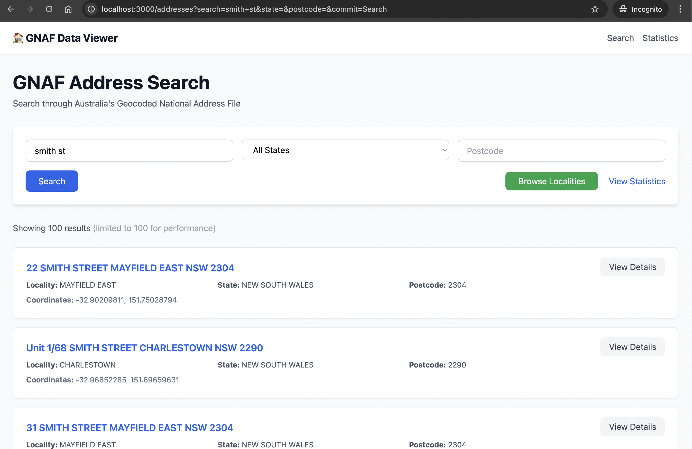

# GNAF Data Viewer

A vibe-coded pile of slop for importing and querying the Geocoded National Address File (G-NAF) data locally. Despite being hastily assembled, it somehow successfully imports **16.7 million** Australian addresses.

## What This App Actually Does


*Search through 16.7 million Australian addresses with coordinates and postcodes*


*Browse 17,576 Australian localities with address counts and CSV export*


*View all addresses in a locality with bulk selection and export*


*Find addresses by street name, locality, or postcode across all states*

## About G-NAF

The Geocoded National Address File (G-NAF) is Australia's authoritative, geocoded address file. It contains over 16 million Australian physical address records. The data is sourced from each state and territory's addressing authorities and is updated regularly.

## Data Source

Download the G-NAF data from: https://data.gov.au/data/dataset/geocoded-national-address-file-g-naf

The application expects the downloaded ZIP file to be available locally for seeding the database.

## Setup

### Prerequisites

* Ruby 3.4.4
* Rails 8.0+
* PostgreSQL 17

### Installation

1. Clone the repository
2. Install dependencies:
   ```bash
   bundle install
   ```

3. Setup the database:
   ```bash
   rails db:create
   rails db:migrate
   ```

4. Download the G-NAF ZIP file (no need to extract manually)
5. Seed the database with G-NAF data (optimized import, ~30-60 minutes):
   ```bash
   GNAF_ZIP_PATH=/path/to/g-naf_aug25_allstates_gda94_psv_1020.zip rails db:seed
   ```
   
   The import process automatically:
   - Extracts ZIP to temporary directory for faster access
   - Imports all states and territories
   - Processes locality coordinates from LOCALITY_POINT files
   - Derives postcodes from address data
   - Uses batch inserts for optimal performance

## License

This project is licensed under the MIT License - see the [LICENSE](LICENSE) file for details.

The G-NAF data is provided under the Creative Commons Attribution 4.0 International licence.
